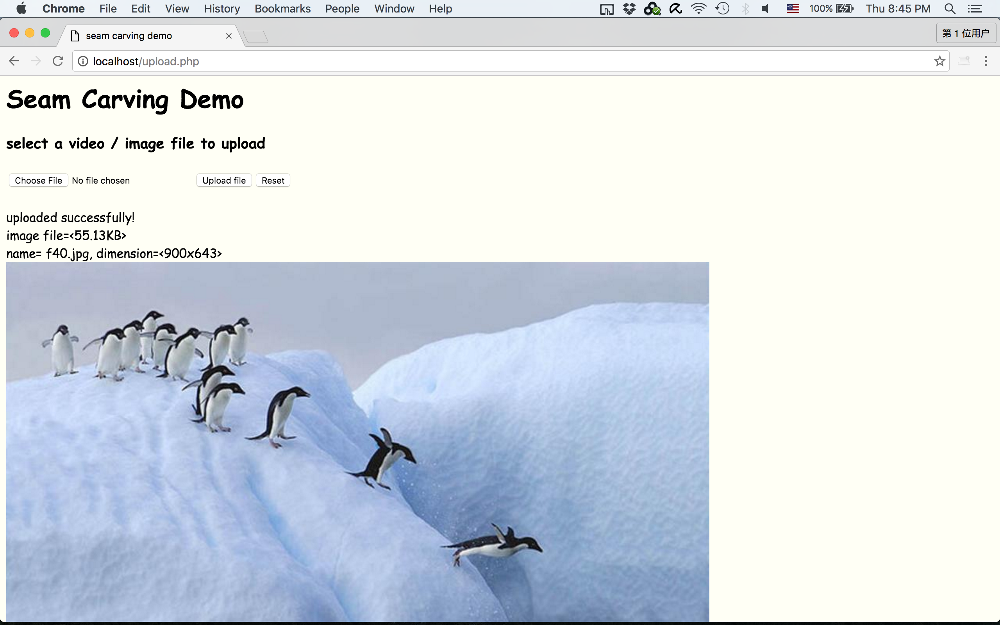
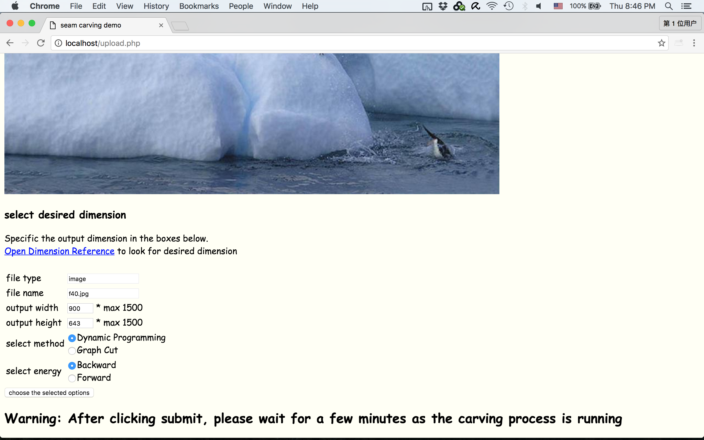
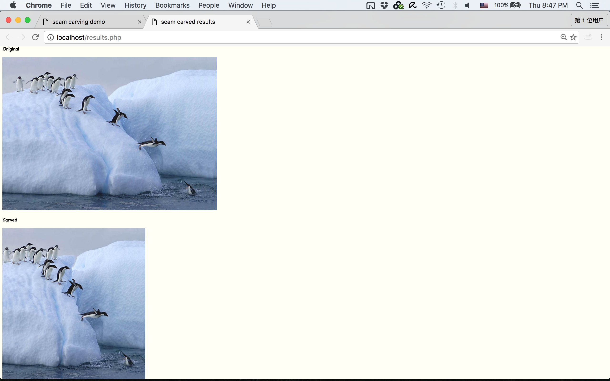

# Seam Carving

## Links
Project page: [https://blackruan.github.io/seam-carving/](https://blackruan.github.io/seam-carving/)

## Overview
In this project, we have done the following three things:

1. Implemented the seam-carving algorithm in papers [Seam Carving for Content-Aware Image Resizing](http://www.faculty.idc.ac.il/arik/SCWeb/imret/) and [Improved Seam Carving for Video Retargeting](http://www.faculty.idc.ac.il/Arik/SCWeb/vidret/index.html).

2. Proposed and implemented a new approach to the seam-carving in video retargeting for increasing the running speed while maintaining the processing effect.

3. Developed a web-based demo for users to try the magic of seam-carving.

## Background
**Seam carving** is an algorithm for content-aware image resizing, developed by Shai Avidan, of Mitsubishi Electric Research Laboratories (MERL), and Ariel Shamir, of the Interdisciplinary Center and MERL. Adobe Systems acquired a non-exclusive license to seam carving technology from MERL, and implemented it as a feature in Photoshop CS4, where it is called Content Aware Scaling.

## Image Seam Carving
Chose L1-norm of the gradient as our energy function for each pixel. The optimal seam is obtained using dynamic programming. We have implemented the reduction and expansion for the images and the results can be viewed on the [project page](https://blackruan.github.io/seam-carving/).

## Parallel Video Retargeting
The biggest problem of the seam-carving algorithm for videos in the paper is the speed. Thus, instead of applying graph-cut on the whole video cube, we calculted the seam for each frame seperately. At the same time, we tried to maintain the temporal coherency between frames by using the look-ahead energy. In other words, the optimal seam for one frame is achieved by finding the minimum cut on the cube which consists of the current frame and the next 4 frames. In this way, the speed is greatly increased. Another advantage of our approach is that we can parallelize the computation so that the process is accelerated again.

## Web demo

